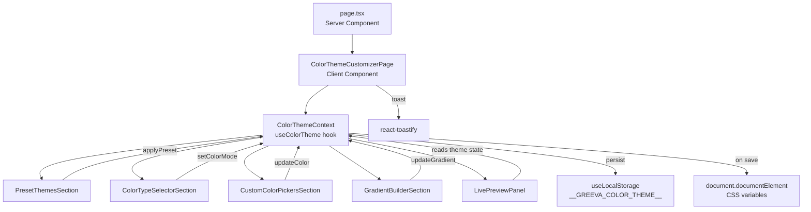
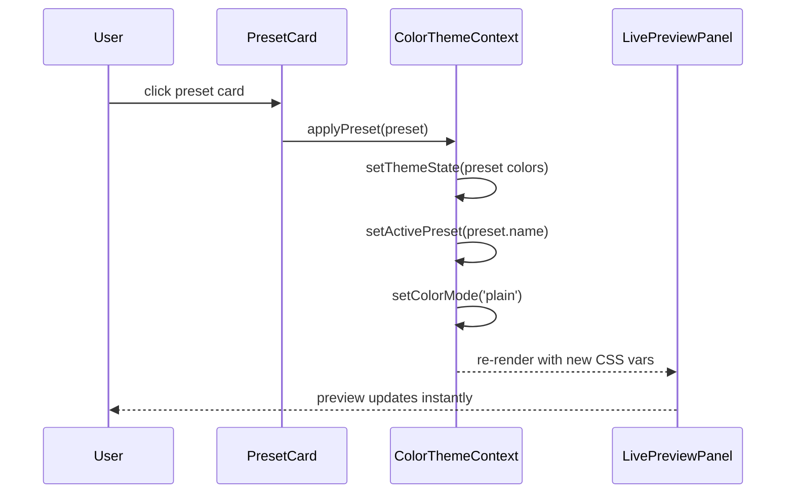
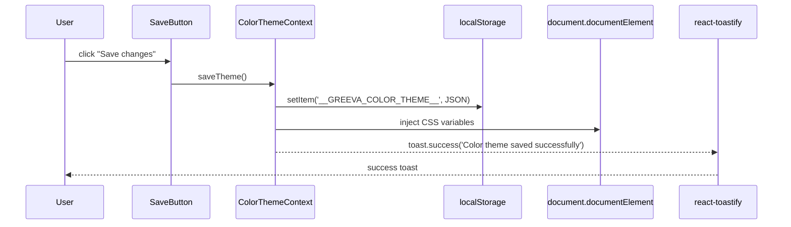
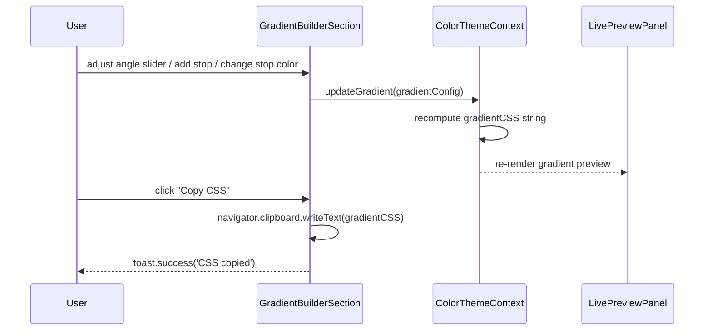

# Design Document: Color Theme Customizer

## Overview

The Color Theme Customizer is a full-page settings screen within the Greeva Next.js admin panel that lets users visually configure the panel's color identity. It extends the existing `ColorThemeSettingsPanel` at `src/app/(admin)/settings/color-theme/` with a richer feature set: preset themes, plain/gradient/pattern background modes, a gradient builder, and a live mini-panel preview — all wired through a single React context so every change reflects instantly.

The page lives at `/settings/color-theme` inside the `(admin)` route group, uses the existing `VerticalLayout` wrapper, and persists the chosen theme to `localStorage` via the project's `useLocalStorage` hook. CSS custom properties (`--theme-*`) are injected onto the preview container and, on save, onto the document root so the entire admin panel reflects the chosen palette.

---

## Architecture



---

## Sequence Diagrams

### Preset Application Flow



### Save Changes Flow



### Gradient Builder Flow



---

## Components and Interfaces

### Component Hierarchy

```
ColorThemeCustomizerPage (client)
├── PageHeader
│   ├── title + subtitle
│   └── SaveButton
├── TwoColumnLayout
│   ├── LeftColumn
│   │   ├── PresetThemesSection
│   │   │   └── PresetCard × 6
│   │   ├── ColorTypeSelectorSection
│   │   │   ├── ColorTypeTab (Plain | Gradient | Image/Pattern)
│   │   │   ├── PlainColorEditor
│   │   │   ├── GradientColorEditor
│   │   │   └── PatternSelector
│   │   ├── CustomColorPickersSection
│   │   │   └── ColorPickerRow × 5
│   │   └── GradientBuilderSection (expandable)
│   │       ├── AngleSlider
│   │       ├── ColorStopList
│   │       │   └── ColorStopRow × n
│   │       ├── GradientPreviewStrip
│   │       └── CopyCSSButton
│   └── RightColumn
│       └── LivePreviewPanel
│           ├── LightDarkToggle
│           └── MiniAdminMockup
│               ├── MockSidebar
│               ├── MockTopbar
│               ├── MockStatCards × 2
│               └── MockChartCard
```

### Component Interfaces

```typescript
// PresetThemesSection
interface PresetThemesSectionProps {
  presets: PresetTheme[]
  activePreset: string
  onApply: (preset: PresetTheme) => void
}

// PresetCard
interface PresetCardProps {
  preset: PresetTheme
  isActive: boolean
  onClick: () => void
}

// ColorTypeSelectorSection
interface ColorTypeSelectorSectionProps {
  colorMode: ColorMode
  plainColor: string
  gradientConfig: GradientConfig
  selectedPattern: PatternId
  onColorModeChange: (mode: ColorMode) => void
  onPlainColorChange: (hex: string) => void
  onGradientChange: (config: Partial<GradientConfig>) => void
  onPatternChange: (id: PatternId) => void
}

// CustomColorPickersSection
interface CustomColorPickersSectionProps {
  theme: ThemeColors
  pageColorMode: ColorMode
  onColorChange: (key: keyof ThemeColors, value: string) => void
  onPageColorModeChange: (mode: ColorMode) => void
}

// ColorPickerRow
interface ColorPickerRowProps {
  label: string
  colorKey: keyof ThemeColors
  value: string
  showModeToggle?: boolean
  pageColorMode?: ColorMode
  onChange: (value: string) => void
  onModeChange?: (mode: ColorMode) => void
}

// GradientBuilderSection
interface GradientBuilderSectionProps {
  isExpanded: boolean
  onToggle: () => void
  gradientConfig: GradientConfig
  onGradientChange: (config: GradientConfig) => void
}

// ColorStopRow
interface ColorStopRowProps {
  stop: ColorStop
  index: number
  canRemove: boolean
  onChange: (index: number, stop: Partial<ColorStop>) => void
  onRemove: (index: number) => void
}

// LivePreviewPanel
interface LivePreviewPanelProps {
  previewMode: 'light' | 'dark'
  cssVars: Record<string, string>
  onModeChange: (mode: 'light' | 'dark') => void
}
```

---

## Data Models

### Core Types

```typescript
// Color mode for page background and color type selector
type ColorMode = 'plain' | 'gradient' | 'pattern'

// Gradient direction options
type GradientDirection = 'horizontal' | 'vertical' | 'diagonal' | 'radial'

// Pattern identifiers
type PatternId = 'dots' | 'lines' | 'grid' | 'noise' | 'waves' | 'geometric'

// A single color stop in the gradient builder
interface ColorStop {
  id: string          // uuid for React key
  color: string       // hex string e.g. '#0ea5e9'
  position: number    // 0–100 (percentage)
}

// Full gradient configuration
interface GradientConfig {
  direction: GradientDirection
  angle: number           // 0–360 degrees (used when direction is not radial)
  stops: ColorStop[]      // minimum 2 stops
}

// The five named color slots
interface ThemeColors {
  primary: string
  accent: string
  sidebar: string
  page: string
  text: string
}

// A preset theme bundle
interface PresetTheme {
  name: string
  primary: string
  accent: string
  sidebar: string
  page: string
  text: string
  gradientConfig?: GradientConfig   // optional preset gradient
}

// Full persisted state shape
interface ColorThemeState {
  activePreset: string              // '' when custom
  colors: ThemeColors
  colorMode: ColorMode              // page background type selector
  pageColorMode: ColorMode          // inline toggle on page background row
  gradientConfig: GradientConfig
  selectedPattern: PatternId
  previewMode: 'light' | 'dark'
  gradientBuilderExpanded: boolean
}
```

**Validation Rules:**
- `ColorStop.position` must be in range [0, 100]
- `GradientConfig.stops` must have at least 2 entries
- `GradientConfig.angle` must be in range [0, 360]
- All hex color strings must match `/^#[0-9a-fA-F]{6}$/`
- `ThemeColors` fields are all required (no partial saves)

---

## State Management

The feature uses a single React context (`ColorThemeContext`) co-located with the page. No external state library is needed — the state shape is self-contained and the context is only mounted within this page tree.

```typescript
interface ColorThemeContextValue {
  state: ColorThemeState
  applyPreset: (preset: PresetTheme) => void
  setColorMode: (mode: ColorMode) => void
  updateColor: (key: keyof ThemeColors, value: string) => void
  setPageColorMode: (mode: ColorMode) => void
  updateGradient: (config: Partial<GradientConfig>) => void
  addColorStop: () => void
  removeColorStop: (index: number) => void
  updateColorStop: (index: number, stop: Partial<ColorStop>) => void
  setSelectedPattern: (id: PatternId) => void
  setPreviewMode: (mode: 'light' | 'dark') => void
  toggleGradientBuilder: () => void
  saveTheme: () => void
  computedCSSVars: Record<string, string>
  gradientCSS: string
}
```

State is initialized from `localStorage` key `__GREEVA_COLOR_THEME__` via the existing `useLocalStorage` hook, falling back to the Ocean preset defaults.

---

## Algorithmic Pseudocode

### Algorithm 1: computeGradientCSS

```pascal
ALGORITHM computeGradientCSS(config: GradientConfig): string
INPUT: config — gradient direction, angle, and color stops
OUTPUT: valid CSS gradient string

BEGIN
  // Sort stops by position ascending
  sortedStops ← SORT config.stops BY stop.position ASC

  // Build stop list string: "#hex position%"
  stopList ← ""
  FOR each stop IN sortedStops DO
    stopList ← stopList + stop.color + " " + stop.position + "% "
  END FOR
  stopList ← TRIM(stopList)

  IF config.direction = 'radial' THEN
    RETURN "radial-gradient(circle, " + stopList + ")"
  END IF

  // Map direction to angle
  IF config.direction = 'horizontal' THEN
    angle ← 90
  ELSE IF config.direction = 'vertical' THEN
    angle ← 180
  ELSE IF config.direction = 'diagonal' THEN
    angle ← 135
  ELSE
    angle ← config.angle   // custom angle from slider
  END IF

  RETURN "linear-gradient(" + angle + "deg, " + stopList + ")"
END
```

**Preconditions:**
- `config.stops.length >= 2`
- All `stop.position` values are in [0, 100]
- All `stop.color` values are valid hex strings

**Postconditions:**
- Returns a non-empty string that is valid CSS
- Stops are ordered by position in the output

**Loop Invariants:**
- All previously appended stops have valid color and position values

---

### Algorithm 2: computeCSSVars

```pascal
ALGORITHM computeCSSVars(state: ColorThemeState): Record<string, string>
INPUT: state — full theme state including colors, mode, gradient, pattern
OUTPUT: CSS custom property map to inject into the preview container

BEGIN
  vars ← {}

  vars['--theme-primary'] ← state.colors.primary
  vars['--theme-accent']  ← state.colors.accent
  vars['--theme-sidebar'] ← state.colors.sidebar
  vars['--theme-text']    ← state.colors.text

  // Page background depends on active mode
  IF state.pageColorMode = 'plain' THEN
    vars['--theme-page'] ← state.colors.page
    vars['--theme-page-bg'] ← state.colors.page
  ELSE IF state.pageColorMode = 'gradient' THEN
    vars['--theme-page'] ← state.colors.page
    vars['--theme-page-bg'] ← computeGradientCSS(state.gradientConfig)
  ELSE IF state.pageColorMode = 'pattern' THEN
    vars['--theme-page'] ← state.colors.page
    vars['--theme-page-bg'] ← buildPatternCSS(state.selectedPattern, state.colors.page)
  END IF

  // Dark mode overrides
  IF state.previewMode = 'dark' THEN
    vars['--theme-page']    ← '#101827'
    vars['--theme-page-bg'] ← '#101827'
    vars['--theme-text']    ← '#f8fafc'
    vars['--theme-card']    ← '#182235'
    vars['--theme-muted']   ← '#94a3b8'
  ELSE
    vars['--theme-card']  ← '#ffffff'
    vars['--theme-muted'] ← '#64748b'
  END IF

  RETURN vars
END
```

**Preconditions:**
- `state` is a fully initialized `ColorThemeState`
- `computeGradientCSS` and `buildPatternCSS` are available

**Postconditions:**
- All `--theme-*` variables required by the SCSS are present in the output map
- Dark mode overrides take precedence over user-chosen page color

---

### Algorithm 3: buildPatternCSS

```pascal
ALGORITHM buildPatternCSS(patternId: PatternId, baseColor: string): string
INPUT: patternId — one of the 6 pattern types; baseColor — hex background color
OUTPUT: CSS background shorthand string combining color and SVG/gradient pattern

BEGIN
  // Each pattern is an SVG data URI or repeating gradient
  MATCH patternId WITH
    'dots'       → patternUri ← svgDots(baseColor)
    'lines'      → patternUri ← svgLines(baseColor)
    'grid'       → patternUri ← svgGrid(baseColor)
    'noise'      → patternUri ← svgNoise(baseColor)
    'waves'      → patternUri ← svgWaves(baseColor)
    'geometric'  → patternUri ← svgGeometric(baseColor)
  END MATCH

  RETURN baseColor + " " + patternUri + " repeat"
END
```

**Preconditions:**
- `patternId` is one of the 6 valid `PatternId` values
- `baseColor` is a valid hex string

**Postconditions:**
- Returns a CSS background value that layers the SVG pattern over the base color

---

### Algorithm 4: applyPreset

```pascal
ALGORITHM applyPreset(preset: PresetTheme, state: ColorThemeState): ColorThemeState
INPUT: preset — a preset theme bundle; state — current theme state
OUTPUT: new ColorThemeState with preset applied

BEGIN
  newColors ← {
    primary: preset.primary,
    accent:  preset.accent,
    sidebar: preset.sidebar,
    page:    preset.page,
    text:    preset.text
  }

  newGradient ← IF preset.gradientConfig IS NOT NULL
                THEN preset.gradientConfig
                ELSE state.gradientConfig

  RETURN {
    ...state,
    colors:        newColors,
    activePreset:  preset.name,
    colorMode:     'plain',
    pageColorMode: 'plain',
    gradientConfig: newGradient
  }
END
```

**Preconditions:**
- `preset` contains all five color fields
- `state` is a valid `ColorThemeState`

**Postconditions:**
- `activePreset` equals `preset.name`
- `colorMode` and `pageColorMode` are reset to `'plain'`
- All five `ThemeColors` fields reflect the preset values

---

### Algorithm 5: saveTheme

```pascal
ALGORITHM saveTheme(state: ColorThemeState): void
INPUT: state — current theme state to persist
OUTPUT: side effects — localStorage write + DOM CSS variable injection + toast

BEGIN
  // 1. Persist to localStorage
  localStorage.setItem('__GREEVA_COLOR_THEME__', JSON.stringify(state))

  // 2. Compute final CSS vars (always light mode for global apply)
  globalState ← { ...state, previewMode: 'light' }
  cssVars ← computeCSSVars(globalState)

  // 3. Inject onto document root
  root ← document.documentElement
  FOR each [property, value] IN ENTRIES(cssVars) DO
    root.style.setProperty(property, value)
  END FOR

  // 4. Notify user
  toast.success('Color theme saved successfully')
END
```

**Preconditions:**
- `state` is a valid, fully populated `ColorThemeState`
- `document` is available (client-side only)

**Postconditions:**
- `localStorage` contains the serialized state
- All `--theme-*` CSS variables on `:root` reflect the saved values
- A success toast is visible to the user

---

## Key Functions with Formal Specifications

### `useColorTheme(initialState?: Partial<ColorThemeState>): ColorThemeContextValue`

**Purpose:** Custom hook that owns all theme state and exposes actions.

**Preconditions:**
- Must be called inside `ColorThemeProvider`
- `initialState` fields, if provided, must be valid

**Postconditions:**
- Returns a stable context value (memoized with `useMemo`)
- `computedCSSVars` is always in sync with current state
- `gradientCSS` is always in sync with `state.gradientConfig`

---

### `addColorStop(): void`

**Preconditions:**
- `state.gradientConfig.stops.length < 10` (UI cap)

**Postconditions:**
- A new `ColorStop` is appended with a unique `id`, color `#94a3b8`, and `position` midway between the last two stops
- `gradientCSS` is recomputed

**Loop Invariants:** N/A (single insertion)

---

### `removeColorStop(index: number): void`

**Preconditions:**
- `state.gradientConfig.stops.length > 2` (minimum 2 stops enforced)
- `index` is in range `[0, stops.length - 1]`

**Postconditions:**
- Stop at `index` is removed
- Remaining stops retain their original order and values
- `gradientCSS` is recomputed

---

### `updateColorStop(index: number, stop: Partial<ColorStop>): void`

**Preconditions:**
- `index` is in range `[0, stops.length - 1]`
- If `stop.position` is provided, it must be in [0, 100]
- If `stop.color` is provided, it must be a valid hex string

**Postconditions:**
- Stop at `index` is updated with the provided partial values
- Other stops are unchanged
- `gradientCSS` is recomputed

---

## Example Usage

```typescript
// Consuming the context in a child component
import { useColorTheme } from './ColorThemeContext'

const PresetCard = ({ preset }: { preset: PresetTheme }) => {
  const { state, applyPreset } = useColorTheme()
  const isActive = state.activePreset === preset.name

  return (
    <button
      type="button"
      className={clsx(styles.presetCard, isActive && styles.activePreset)}
      onClick={() => applyPreset(preset)}
    >
      <span className={styles.presetPreview}>
        <span style={{ backgroundColor: preset.page }} />
        <span style={{ backgroundColor: preset.sidebar }} />
        <i style={{ backgroundColor: preset.primary }} />
      </span>
      <span className={styles.presetFooter}>
        <strong>{preset.name}</strong>
        {isActive && <IconifyIcon icon="tabler:check" />}
      </span>
    </button>
  )
}
```

```typescript
// Gradient builder — adding a stop
const GradientBuilderSection = () => {
  const { state, addColorStop, removeColorStop, updateColorStop, gradientCSS } = useColorTheme()
  const { stops } = state.gradientConfig

  return (
    <div className={styles.gradientBuilder}>
      {stops.map((stop, i) => (
        <ColorStopRow
          key={stop.id}
          stop={stop}
          index={i}
          canRemove={stops.length > 2}
          onChange={updateColorStop}
          onRemove={removeColorStop}
        />
      ))}
      <button onClick={addColorStop} disabled={stops.length >= 10}>
        + Add stop
      </button>
      <div className={styles.gradientStrip} style={{ background: gradientCSS }} />
      <CopyCSSButton css={gradientCSS} />
    </div>
  )
}
```

```typescript
// LivePreviewPanel — injecting CSS vars
const LivePreviewPanel = () => {
  const { computedCSSVars, state, setPreviewMode } = useColorTheme()

  return (
    <aside className={styles.previewPanel} style={computedCSSVars as CSSProperties}>
      <LightDarkToggle mode={state.previewMode} onChange={setPreviewMode} />
      <MiniAdminMockup />
    </aside>
  )
}
```

---

## Correctness Properties

### Property 1: Preset completeness

For every preset `p`, after `applyPreset(p)`, `state.colors` equals `{ primary: p.primary, accent: p.accent, sidebar: p.sidebar, page: p.page, text: p.text }`.

### Property 2: Active preset cleared on manual edit

For any call to `updateColor(key, value)`, `state.activePreset` becomes `''`.

### Property 3: Gradient stop ordering

`computeGradientCSS` always produces stops in ascending position order regardless of insertion order.

### Property 4: Minimum stop invariant

`state.gradientConfig.stops.length >= 2` at all times; `removeColorStop` is a no-op when length equals 2.

### Property 5: CSS var completeness

`computedCSSVars` always contains all seven keys: `--theme-primary`, `--theme-accent`, `--theme-sidebar`, `--theme-page`, `--theme-page-bg`, `--theme-card`, `--theme-muted`.

### Property 6: Dark mode isolation

Changes to `state.previewMode` affect only `computedCSSVars`; they do not mutate `state.colors`.

### Property 7: Save idempotency

Calling `saveTheme()` twice with the same state produces identical `localStorage` content and identical DOM CSS variables.

### Property 8: Hex validation

`updateColor` and `updateColorStop` only accept strings matching `/^#[0-9a-fA-F]{6}$/`; invalid inputs are silently ignored.

---

## Error Handling

### Scenario 1: localStorage unavailable (SSR or private browsing)

**Condition:** `window.localStorage` throws or is undefined during initialization.
**Response:** Fall back to in-memory state using the Ocean preset defaults (mirrors the existing `useLocalStorage` hook behavior).
**Recovery:** State is fully functional for the session; save will silently skip the `localStorage.setItem` call.

### Scenario 2: Clipboard API unavailable

**Condition:** `navigator.clipboard.writeText` rejects (non-HTTPS or browser restriction).
**Response:** Catch the rejection and show `toast.error('Could not copy — please copy manually')`.
**Recovery:** Display the raw CSS string in a read-only `<textarea>` as a fallback.

### Scenario 3: Invalid hex input from color picker

**Condition:** Browser `<input type="color">` always returns valid 6-digit hex, but programmatic calls may pass invalid strings.
**Response:** Validate with `/^#[0-9a-fA-F]{6}$/` before updating state; reject silently.
**Recovery:** State retains the previous valid color value.

### Scenario 4: Gradient with fewer than 2 stops (corrupt localStorage)

**Condition:** Deserialized state from `localStorage` has `stops.length < 2`.
**Response:** During initialization, if `stops.length < 2`, reset `gradientConfig` to the default two-stop gradient.
**Recovery:** User sees a valid gradient builder with the default stops.

---

## Testing Strategy

### Unit Testing Approach

Test pure utility functions in isolation:
- `computeGradientCSS` — verify output for each `GradientDirection`, verify stop ordering, verify radial branch.
- `computeCSSVars` — verify all 7 keys present, verify dark mode overrides, verify `pageColorMode` branching.
- `buildPatternCSS` — verify each of the 6 pattern IDs returns a non-empty string containing the base color.
- `applyPreset` — verify all 5 color fields are set, `activePreset` matches, `colorMode` resets to `'plain'`.

### Property-Based Testing Approach

**Property Test Library:** fast-check (already compatible with the project's TypeScript/Jest setup)

Key properties to test:
- **Gradient CSS is always valid CSS:** For any array of ≥2 color stops with positions in [0,100], `computeGradientCSS` returns a string starting with `linear-gradient(` or `radial-gradient(`.
- **Stop ordering:** For any unsorted array of stops, the output CSS lists stops in ascending position order.
- **CSS var completeness:** For any valid `ColorThemeState`, `computedCSSVars` always contains exactly the 7 required keys.
- **Preset round-trip:** For any preset `p`, `applyPreset(p, state).colors` deep-equals the preset's color fields.

### Integration Testing Approach

- Render `ColorThemeCustomizerPage` in a test environment and verify:
  - Clicking a preset card updates the preview panel's CSS variables.
  - Changing a color picker value clears `activePreset`.
  - Clicking "Save changes" calls `localStorage.setItem` and triggers a toast.
  - The gradient builder's "Copy CSS" button calls `navigator.clipboard.writeText`.
  - The light/dark toggle changes `--theme-card` and `--theme-muted` in the preview.

---

## Performance Considerations

- `computedCSSVars` and `gradientCSS` are memoized with `useMemo` — they only recompute when the relevant state slices change.
- The `LivePreviewPanel` is wrapped in `React.memo` to prevent re-renders when unrelated state (e.g., `gradientBuilderExpanded`) changes.
- CSS variable injection on the preview container (not `document.documentElement`) keeps preview updates scoped and avoids layout thrashing on the rest of the page.
- Pattern SVG data URIs are generated once per pattern ID and memoized in a module-level `Map` — they are not regenerated on every render.
- The gradient builder's angle slider uses a debounced `onChange` (16ms, one animation frame) to avoid excessive state updates during drag.

---

## Security Considerations

- All color values written to CSS variables are validated against `/^#[0-9a-fA-F]{6}$/` before injection into the DOM to prevent CSS injection.
- The `gradientCSS` string written to the clipboard is constructed entirely from validated hex values and numeric angles — no user-supplied free-text is interpolated.
- `localStorage` data is parsed with a `try/catch` and validated against the expected shape before use; malformed data falls back to defaults.
- SVG pattern data URIs are static strings defined in source code — no user input is embedded in them.

---

## File Structure

```
src/app/(admin)/settings/color-theme/
├── page.tsx                          # Server component, metadata
├── ColorThemeCustomizerPage.tsx      # Root client component, context provider
├── ColorThemeContext.tsx             # Context + useColorTheme hook
├── colorThemeDefaults.ts             # Preset data, default state, pattern SVGs
├── colorThemeUtils.ts                # Pure functions: computeGradientCSS, computeCSSVars, buildPatternCSS
├── components/
│   ├── PageHeader.tsx
│   ├── PresetThemesSection.tsx
│   ├── PresetCard.tsx
│   ├── ColorTypeSelectorSection.tsx
│   ├── PlainColorEditor.tsx
│   ├── GradientColorEditor.tsx
│   ├── PatternSelector.tsx
│   ├── CustomColorPickersSection.tsx
│   ├── ColorPickerRow.tsx
│   ├── GradientBuilderSection.tsx
│   ├── ColorStopRow.tsx
│   ├── GradientPreviewStrip.tsx
│   ├── CopyCSSButton.tsx
│   ├── LivePreviewPanel.tsx
│   ├── LightDarkToggle.tsx
│   └── MiniAdminMockup.tsx
└── ColorThemeCustomizerPage.module.scss  # All scoped styles
```

---

## Dependencies

All dependencies are already present in `package.json`:

| Dependency | Usage |
|---|---|
| `react` / `react-dom` 19 | Component model, hooks, context |
| `next` 15 | App Router, `Metadata`, Server Components |
| `react-toastify` | Success/error toast notifications |
| `@iconify/react` | Icons (`tabler:palette`, `tabler:check`, etc.) |
| `clsx` | Conditional class names |
| `sass` | SCSS module compilation |
| `typescript` | Type safety throughout |

No new dependencies are required. The `useLocalStorage` hook from `src/hooks/useLocalStorage.ts` is reused directly for persistence.
